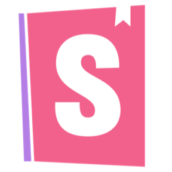

<h1 align="center">Hey, I'm Kyle Peeler! 👋</h1>

I am a front-end focused developer 👨‍💻 living in in the Bay Area of California. I love all things React ⚛️, and am passionate about creating intuitive and beautiful user experiences that are accessible ♿️ to everyone through the internet and technology.

- ✏️ Learning in public at [kylepeeler.codes](https://kylepeeler.codes)
- 🔭 Currently working on rebuilding my personal website + blog
- 🌱 I’m currently learning `Vue.js` & `TypeScript`
- 💬 Ask me about `React`, `Redux`, `Storybook` or other front-end technologies
- 📫 How to reach me: `me at kylepeeler dot com`
- 😄 Pronouns: `he/him`

## Connect with me

  

  

  

  

  

## My Skill Set

<table>
  
<tr>

<td valign="top" width="33%">

  
### Client-side

  
  
  
  
  
  
  
  
  
  
  
  

</td>

<td valign="top" width="33%">

### Server-side

  
  
  
  
  
  

</td>

<td valign="top" width="33%">

### DevOps && Tools

</td>

</tr>
</table>

## Github Stats

 
